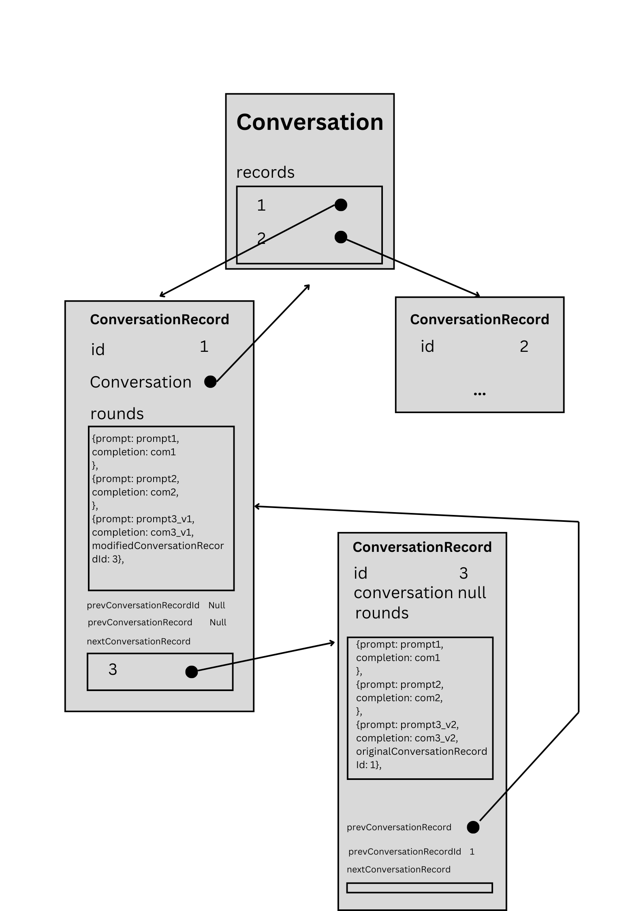

## Schema

See ./prisma/schema.prisma for the schema definition.
The conversation related part needs extra explanation.
Below is the schema for conversation:

```
model Conversation {
  id             String   @id @map("_id") @default(auto()) @db.ObjectId
  contributor    User?     @relation(fields: [contributorId], references: [id], onDelete: NoAction, onUpdate: Cascade)
  contributorId  String   @db.ObjectId
  records        ConversationRecord[]
}

model ConversationRecord {
  id         String   @id @map("_id") @default(auto()) @db.ObjectId
  rounds ConversationRound[]
  conversation Conversation? @relation(fields: [conversationId], references: [id], onDelete: Cascade, onUpdate: Cascade)
  conversationId String? @db.ObjectId
  prevConversationRecordId String? @db.ObjectId
  prevConversationRecord ConversationRecord? @relation("conversationTree", fields: [prevConversationRecordId], references: [id], onDelete: NoAction, onUpdate: NoAction)
  nextConversationRecords ConversationRecord[] @relation("conversationTree")
  modelName String
  rating     Int?
}

type ConversationRound {
  prompt     String
  completion String
  nextConversationRecordIds String[] @db.ObjectId
}
```

Conversation is the main entity, which contains a list of conversation records in a session. For Chatbot Arena, there are two conversation records in a session since there are two conversations of different model going on at the same time.

Each ConversationRecord contains a list of conversation rounds, which are the conversation history of the user and the chatbot.

A rating is done for the whole ConversationRecord. The user should rate after the user finishes all conversations with the model and would like to open a brand new conversation. For the rating part, the rating is an integer. 1 means the completion is better than the other completion, 0 means equal, -1 means the completion is worse than the other completion.

The prevConversationRecord and nextConversationRecord part is a little be tricky. The relation is shown as the diagram below.



Once the conversation is modified, a new ConversationRecord object will be created. The nextConversationRecordIds indicates the different version of modifications of the conversation, which difference starts from this specific ConversationRound.

The prevConversationRecordId indicates the previous version of the conversation, if the conversation is a root conversation, the prevConversationRecordId will be null. The conversation attribute of the ConversationRecord object indicates the conversation that the ConversationRecord belongs to, if the conversation is NOT a root conversation, the conversation attribute will be null.

The nextConversationRecords indicates the next versions of the conversation, all ConversationRecord objects appearing in the ConversationRound.nextConversationRecordIds will be stored in the nextConversationRecords to keep the relationship between the ConversationRecord objects. The reason why we do not include the nextConversationRecords is because in Prisma we cannot use relation in Type object, so we need a way to work around this limitation.
